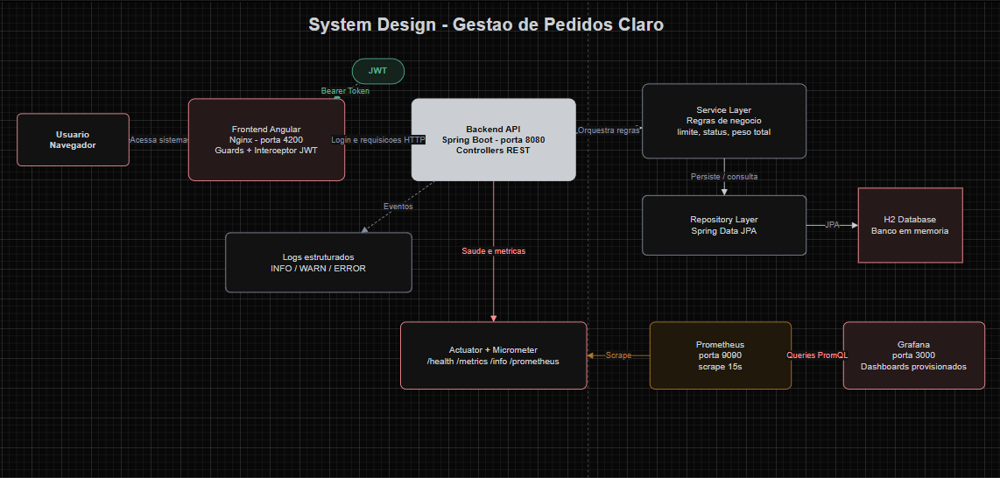

# Desafio Claro - Gestao de Pedidos

Aplicacao full stack para gestao de pedidos de e-commerce, desenvolvida com backend Java/Spring Boot e frontend Angular. O projeto tambem possui observabilidade com Spring Boot Actuator, Micrometer, Prometheus e Grafana.

## Visao Arquitetural



O desenho acima resume o fluxo principal do sistema. O usuario acessa o frontend Angular servido por Nginx, realiza login e recebe um token JWT. A partir disso, o frontend envia requisicoes autenticadas para a API Spring Boot, que organiza a regra de negocio nas camadas de controller, service, mapper e repository. Os dados sao persistidos em banco H2 em memoria, adequado para o desafio tecnico. Em paralelo, o backend expoe endpoints do Actuator para saude e metricas; o Prometheus coleta essas metricas a cada 15 segundos e o Grafana exibe os dashboards provisionados. A API tambem gera logs estruturados para acompanhar eventos importantes da aplicacao.

## Tecnologias

- Java 25
- Spring Boot 4.1
- Spring Security com JWT
- Spring Data JPA
- H2 Database
- Spring Boot Actuator
- Micrometer + Prometheus
- Angular 17
- Angular Material
- Docker Compose
- Grafana
- JaCoCo

## Funcionalidades

- Login com JWT
- Dashboard com indicadores dos pedidos
- Criacao de pedido respeitando limite maximo de 5 pedidos
- Listagem de pedidos com filtro por cliente e status
- Alteracao de status dos pedidos
- Exclusao de pedidos com confirmacao
- Logs estruturados no backend
- Endpoints de observabilidade via Actuator
- Metricas tecnicas e metricas de negocio no Prometheus/Grafana

## Credenciais de acesso

Usuario inicial:

```text
email: admin@claro.com
senha: 123456
```

## Como executar com Docker Compose

Na raiz do projeto, execute:

```bash
docker compose up --build -d
```

Esse comando sobe os servicos:

- Backend Spring Boot
- Frontend Angular servidor por Nginx
- Prometheus
- Grafana

Para acompanhar os containers:

```bash
docker compose ps
```

Para ver os logs do backend em tempo real:

```bash
docker compose logs -f backend
```

Para parar tudo:

```bash
docker compose down
```

Para parar e remover tambem os volumes do Prometheus/Grafana:

```bash
docker compose down -v
```

## URLs da aplicacao

| Servico | URL |
| --- | --- |
| Frontend | http://localhost:4200 |
| Backend | http://localhost:8080 |
| Prometheus | http://localhost:9090 |
| Grafana | http://localhost:3000 |


## Endpoints principais

### Autenticacao

```http
POST /api/auth/login
```

Exemplo de body:

```json
{
  "email": "admin@claro.com",
  "password": "123456"
}
```

### Pedidos

Endpoints protegidos por JWT:

```http
GET /api/pedidos
GET /api/pedidos/{id}
POST /api/pedidos
PATCH /api/pedidos/{id}/status
DELETE /api/pedidos/{id}
```

## Actuator

Endpoints liberados para observabilidade:

```text
http://localhost:8080/actuator/health
http://localhost:8080/actuator/info
http://localhost:8080/actuator/metrics
http://localhost:8080/actuator/prometheus
```

## Prometheus

O Prometheus coleta metricas do backend a cada 15 segundos pelo endpoint:

```text
/actuator/prometheus
```

Arquivo de configuracao:

```text
monitoring/prometheus.yml
```

Para validar no Prometheus, acesse:

```text
http://localhost:9090
```

Queries uteis:

```promql
up{job="claro-pedidos-backend"}
```

```promql
sum by (method, uri, status) (
  rate(http_server_requests_seconds_count{job="claro-pedidos-backend"}[1m])
)
```

```promql
sum(rate(http_server_requests_seconds_sum{job="claro-pedidos-backend"}[1m]))
/
sum(rate(http_server_requests_seconds_count{job="claro-pedidos-backend"}[1m]))
```

```promql
sum by (status) (
  rate(http_server_requests_seconds_count{job="claro-pedidos-backend", status=~"4..|5.."}[1m])
)
```

```promql
sum by (area) (
  jvm_memory_used_bytes{job="claro-pedidos-backend"}
)
```

## Metricas de negocio

O backend expoe metricas especificas de pedidos:

```promql
pedidos_total
```

Total de pedidos exposto no formato esperado pelo Prometheus.

```promql
pedidos_current
```

Total atual de pedidos como Gauge.

```promql
pedidos_by_status
```

Quantidade de pedidos por status. Exemplo de retorno:

```text
pedidos_by_status{status="EM_PROCESSAMENTO"}
pedidos_by_status{status="PAUSADO"}
pedidos_by_status{status="CANCELADO"}
```

## Grafana

Acesse:

```text
http://localhost:3000
```

Credenciais:

```text
usuario: admin
senha: admin
```

O datasource do Prometheus ja e provisionado automaticamente em:

```text
monitoring/grafana/provisioning/datasources/prometheus.yml
```

Os dashboards tambem sao provisionados automaticamente a partir de:

```text
monitoring/grafana/provisioning/dashboards
```

Datasource:

```text
Name: Prometheus
URL: http://prometheus:9090
```

Sugestao de dashboard:

| Painel | Tipo | Query |
| --- | --- | --- |
| Status da API | Stat | `up{job="claro-pedidos-backend"}` |
| Req/s por endpoint | Time series | `sum by (method, uri, status) (rate(http_server_requests_seconds_count{job="claro-pedidos-backend"}[1m]))` |
| Latencia media | Time series | `sum(rate(http_server_requests_seconds_sum{job="claro-pedidos-backend"}[1m])) / sum(rate(http_server_requests_seconds_count{job="claro-pedidos-backend"}[1m]))` |
| Erros 4xx/5xx | Time series | `sum by (status) (rate(http_server_requests_seconds_count{job="claro-pedidos-backend", status=~"4..|5.."}[1m]))` |
| Pedidos total | Stat | `pedidos_total` |
| Pedidos por status | Bar gauge | `sum by (status) (pedidos_by_status)` |

Para o painel de pedidos por status, use o formato de legenda:

```text
{{status}}
```

Assim o Grafana exibe apenas `EM_PROCESSAMENTO`, `PAUSADO` e `CANCELADO`, sem os labels tecnicos.

## Executar backend localmente

Caso queira rodar sem Docker:

```bash
cd backend
```

No Windows PowerShell:

```powershell
$env:JWT_SECRET="12345678901234567890123456789012"
$env:JWT_EXPIRATION="3600000"
.\mvnw spring-boot:run
```

## Executar frontend localmente

Em outro terminal:

```bash
cd frontend
npm install
npm start
```

O frontend local sobe em:

```text
http://localhost:4200
```

## Testes

### Backend

```bash
cd backend
.\mvnw test
```

O projeto usa JaCoCo para gerar relatorio de cobertura dos testes do backend. Depois de executar os testes, o relatorio HTML fica em:

```text
backend/target/site/jacoco/index.html
```

### Frontend

```bash
cd frontend
npm test
```

Para build do frontend:

```bash
cd frontend
npm run build
```

## Observacoes

- O banco H2 e em memoria e usado apenas pela aplicacao; o console web nao e exposto como URL publica no README por seguranca.
- Os dados sao recriados ao reiniciar o backend.
- O backend inicia com usuario e pedidos definidos em `backend/src/main/resources/data.sql`.
- O token JWT e armazenado no navegador para autenticar chamadas protegidas.
- Logs estruturados podem ser acompanhados com `docker compose logs -f backend`.