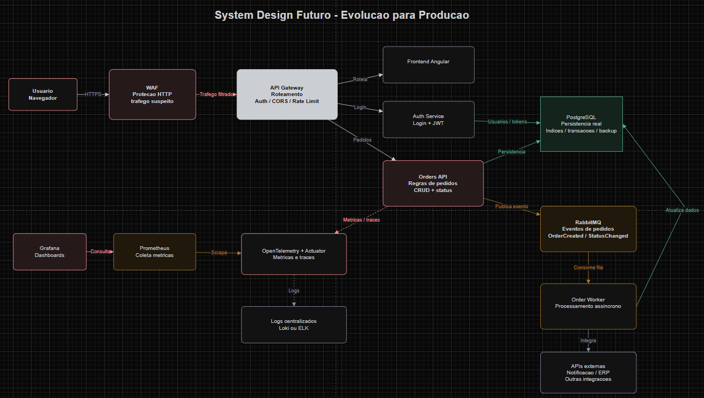

# Melhorias Futuras

A versao atual atende ao desafio tecnico, mas alguns pontos poderiam ser evoluidos caso o sistema fosse preparado para um ambiente de producao.

## Visao Futura de Arquitetura

A ideia principal seria evoluir a aplicacao para uma arquitetura mais preparada para escala, seguranca e integracoes com outros sistemas.

## Banco de Dados Persistente

O primeiro ponto seria substituir o H2 por PostgreSQL. O H2 e adequado para desenvolvimento e avaliacao local, mas em producao seria necessario um banco persistente, com suporte melhor a concorrencia, indices, backup, transacoes e operacao continua.

## API Gateway

Com a necessidade de comunicacao com varias APIs, comum em uma arquitetura de microservicos, uma API Gateway faria sentido para centralizar responsabilidades de entrada, como:

- roteamento para diferentes servicos;
- autenticacao e autorizacao;
- CORS;
- rate limit;
- logs de entrada;
- versionamento de APIs.

Isso evita espalhar regras de borda em todos os servicos e facilita a evolucao da arquitetura.

## WAF

Antes da API Gateway, eu avaliaria o uso de um WAF para aumentar a seguranca da aplicacao. Ele ajudaria a filtrar trafego suspeito e reduzir riscos comuns, como tentativas de SQL Injection, XSS e requisicoes maliciosas.

## RabbitMQ e Processamento Assincrono

Para operacoes que nao precisam bloquear a resposta ao usuario, eu usaria RabbitMQ. Por exemplo, ao criar ou alterar um pedido, a API poderia publicar eventos como `OrderCreated` ou `OrderStatusChanged`.

Esses eventos seriam consumidos por workers, responsaveis por tarefas como:

- notificacoes;
- auditoria;
- integracoes externas;
- processamento de pedidos;
- atualizacao de relatorios.

Isso reduz acoplamento, evita que requisicoes HTTP fiquem presas em tarefas demoradas e ajuda a lidar melhor com concorrencia por recursos.

## Observabilidade Mais Completa

A observabilidade poderia ser evoluida com tracing distribuido usando OpenTelemetry e centralizacao de logs com Loki ou ELK. Isso facilitaria acompanhar uma requisicao passando pela API Gateway, servicos, fila, worker e banco de dados.

## Testes e Qualidade

Tambem seria interessante ampliar os testes automatizados, incluindo mais cenarios de integracao, testes end-to-end no frontend e validacoes de contrato entre frontend e backend.

## Resumo

Se tivesse mais tempo, eu evoluiria o projeto principalmente em quatro frentes: persistencia real com PostgreSQL, seguranca de borda com WAF e API Gateway, processamento assincrono com RabbitMQ e observabilidade mais completa para acompanhar o comportamento da aplicacao em producao.